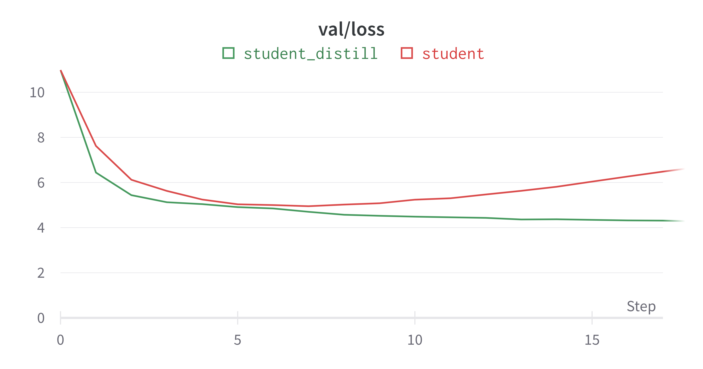

# Optimize the GPT2 model with knowledge distillation on a tiny Shakespeare dataset.

## 1. Distillation
### 1.1 Dataset
- [Tiny Shakespeare](https://huggingface.co/datasets/tiny_shakespeare)

### 1.2 Evaluation metric:
- [Perplexity](https://huggingface.co/docs/transformers/perplexity)

### 1.3 Result
All models are trained or tuned with embedding length (emb) = 1024 and context length (ctx) = 1024.
#### Teacher:

| Model        | Layer | Head | Params | Size  |  loss  |
|:----------   |:----: |:----:| :----: | :---: |  :---: |
| GPT2-medium  |  24   |  16  |  354M  | 1.3GB |  3.036 |


#### Student:
|   Model	    | Layer | Head | Params 	| Size  |  loss   |             |
|:----------  | :----:|:----:|  :----:	| :---: |:-------:|:-----------:|
|       	    |       |      |          |       | Scratch | Distillation|
| GPT-student |   8   |  8   |  152M    | 584MB |   4.95  |    4.259    |

##### KD Loss:
- Causal language model loss (clm loss): Cross Entropy Loss
- Logits matching loss (ce loss): Kullback-Leibler Divergence Loss
- Hidden state matching loss (cosin loss): Cosine Embedding Loss



#### Checkpoint
- GPT2-medium: [Pre-trained](https://drive.google.com/file/d/1y7RYsqrGt7njagHAmGrlA2a6jseGwkGX/view?usp=sharing)
- GPT-student: [Scratch](https://drive.google.com/file/d/191iLVLmueqbAodR0-prCZERNkpEu658p/view?usp=sharing) - [Distillation](https://drive.google.com/file/d/1HPpC1vDZ3-Xms0buUaiekyUMz_wTb3-i/view?usp=sharing)

### 2. Setup
#### 2.1 Install packages
```
pip install -r requirements.txt
```
#### 2.2 Download and prepare dataset
```
cd data/shakespeare
python prepare.py
```
#### 2.3 Training
```
bash run_adamw/finetune_gpt2m.sh
bash run_adamw/train_student.sh
bash run_adamw/train_student_distill.sh
```
### 3. Feature works
- [ ] Benchmark training model with SophiaG.
- [ ] Apply quantization aware training.
- [ ] Apply LoRA/QLoRA

